

  

  
  
  
  

## 👨‍💻 About Me

Hi, I'm **iota9star** — a passionate Full Stack Developer who thrives at the intersection of backend systems, frontend interfaces, and Web3 innovation. I love building digital experiences across the entire stack, from crafting high-performance Rust backends to designing elegant Flutter UIs.

I'm also an **AI Practitioner**, proficient in AI-powered development workflows and constantly vibing with code assistants to level up my productivity. I believe in the power of tools that amplify human creativity.

## 🎯 What I Do

🚀 **Backend Development**: Building scalable microservices with Rust (Axum) and Java (Spring) — performance and reliability are my top priorities.

💻 **Frontend Engineering**: Creating smooth, responsive experiences with React, Vue, and cross-platform magic using Flutter & Dart.

🌐 **Web3 Exploration**: Diving into blockchain technologies across BTC, EVM, and Internet Computer ecosystems.

🤖 **AI-Enhanced Coding**: Leveraging AI tools and assistants to write better code faster, while maintaining high quality standards.

## 🛠️ Tech Stack

### Languages

### Backend

### Frontend & Mobile

### Web3

## 📊 Quick Stats

## 🔥 Featured Projects

<table>
<tr>
<td align="center"></td>
<td align="center"><a href="https://github.com/fluttercandies/fjs">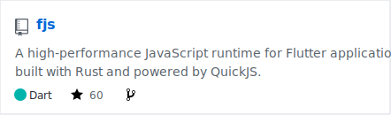</a></td>
</tr><tr>
<td align="center"><a href="https://github.com/fluttercandies/dpad">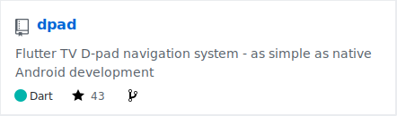</a></td>
<td align="center"><a href="https://github.com/iota9star/sakura-dmhy">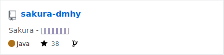</a></td>
</tr><tr>
<td align="center"></td>
<td align="center"><a href="https://github.com/fluttercandies/json_dart">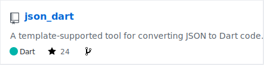</a></td>
</tr><tr>
<td align="center"><a href="https://github.com/void-signals/void_signals">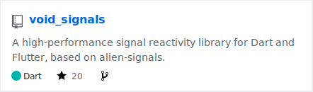</a></td>
<td align="center"><a href="https://github.com/fluttercandies/f_limit">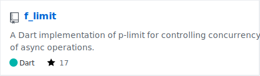</a></td>
</tr><tr>
<td align="center"><a href="https://github.com/fluttercandies/hora">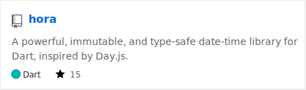</a></td>
<td align="center"><a href="https://github.com/fluttercandies/env2dart">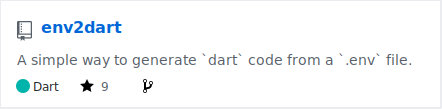</a></td>
</tr><tr>
<td align="center"><a href="https://github.com/fluttercandies/flexbox_layout">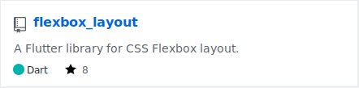</a></td>
<td align="center"></td>
</tr><tr>
<td align="center"><a href="https://github.com/fluttercandies/svgo">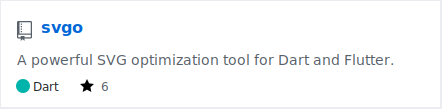</a></td>
<td align="center"><a href="https://github.com/fluttercandies/resx">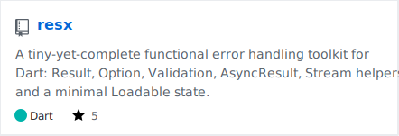</a></td>
</tr><tr>
<td align="center"><a href="https://github.com/fluttercandies/dotrix">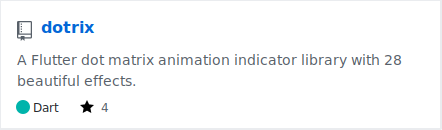</a></td>
<td align="center"><a href="https://github.com/fluttercandies/vcard_dart">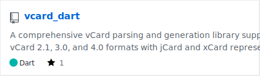</a></td>
</tr>
</table>

## 💡 Daily Inspiration

> 爱,其实很简单，困难的是去接受它。
>
> — 通灵王

## 🏆 Highlights

🎯 **Open Source Contributor**: Active contributor to the FlutterCandies ecosystem, helping build better tools for the Flutter community.

📱 **Mobile Specialist**: Deep expertise in Flutter and Android development, with a focus on polished user experiences.

🔧 **Tool Builder**: Creator of several utility libraries and tools that make developers' lives easier.

🌱 **Continuous Learner**: Always exploring new technologies, from Rust's safety guarantees to Web3's decentralized future.

## 💭 Philosophy

I believe that great software is built at the intersection of technical excellence and user empathy. Every line of code should serve a purpose, every feature should solve a real problem, and every project should leave the world slightly better than we found it.

AI tools have transformed how I work — not by replacing creativity, but by amplifying it. They're the pair programming partners that never sleep, always ready to explore alternatives and catch the bugs we might miss.

## 📈 Contribution Graph

## 📧 Let's Connect

I'm always excited to collaborate on interesting projects, discuss tech, or just chat about the latest developments in the software world. Feel free to reach out!

**📮 Email**: [iota9star@gmail.com](mailto:iota9star@gmail.com)

**🐦 X**: [@iota9star](https://x.com/iota9star)

**📝 Blog**: [Juejin](https://juejin.cn/user/1591748568562829)

**💻 GitHub**: [@iota9star](https://github.com/iota9star)

---

*Made with ❤️ and a dash of AI magic*

