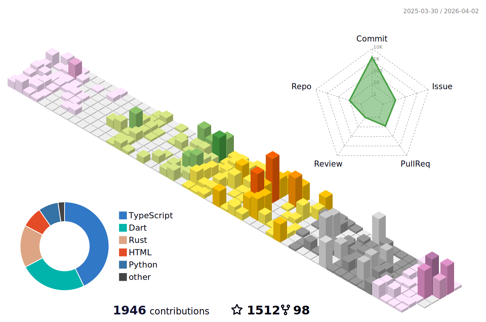

# Web3 & Multi-chain Engineer 🌐🚀 | Full Stack Sorcerer 🔗

## Greetings, I'm **iota9star**! 👋

I'm not just a regular developer - I'm a Web3 & Multi-chain Engineer, well-versed in blockchain technology and capable of wielding magic across multiple blockchain platforms. I'm passionate about creating the future with distributed technologies. 🌟

## 💼 Magical Toolkit

- 🌐 Web3 Mastery: IC, Ethereum, Bitcoin
- 🔗 Multi-chain Weaving: Cross-chain Interactions, Blockchain Deployments
- ✨ Frontend Incantations: React, Vue.js, Flutter
- 🪄 Backend Wizardry: Smart Contracts, Spring, Node.js
- 🌌 Cosmic Mobile Sorcery: Flutter, Android
- ⚙️ Version Control Secrets: Git, GitHub/GitLab
- 🚀 More: RESTful API Design, Cross-platform Spells, Performance Alchemy

## 📬 Reach the Distributed Frontiers!

- 📧 Email: [iota9star@foxmail.com](mailto:iota9star@foxmail.com)
- 🐦 Twitter: [@iota9star](https://twitter.com/iota9star)

## 🌐 More Distributed Chronicles

Join me in further explorations in the distributed realm on:

- 📚 [juejin](https://juejin.cn/user/1591748568562829)

Ready to shape the future of Web3 and multi-chains together? Let's uncover the mysteries of distribution! 🌈✨

  
<b>📈&nbsp;&nbsp;My Github</b>

   
  
  
  
  

