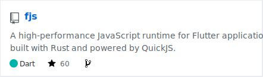
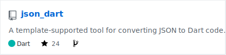
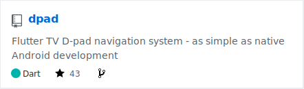
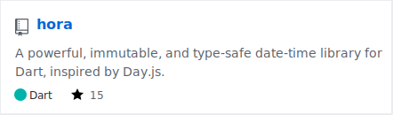
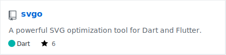
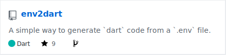
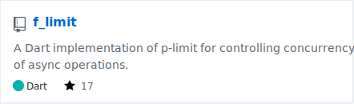
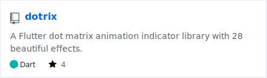
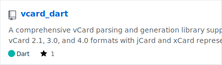
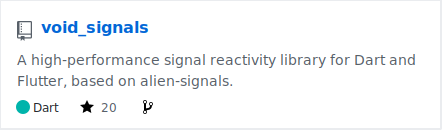

# 👋 Hi, I'm iota9star

**Full Stack Developer | Rust & Java Backend | Product Mindset**

Building digital experiences across the stack — from high-performance backends to elegant frontends. I craft robust systems that scale, blending technical excellence with product thinking.

## 🎯 What I Do

I specialize in building end-to-end solutions with a focus on performance, reliability, and user experience. My work spans from low-level system optimization to crafting delightful interfaces.

🔧 **Backend Architecture**: Designing scalable microservices and high-performance APIs using Rust and Java
💻 **Frontend Engineering**: Creating responsive, accessible experiences with React, Vue, and Flutter
🤖 **AI-Powered Development**: Leveraging AI assistants and code agents to boost productivity and quality
⛓️ **Web3 Innovation**: Building decentralized applications on BTC, EVM, and Internet Computer

## 🛠️ Tech Stack

**Languages & Frameworks**

**Backend Technologies**

**Frontend & Mobile**

**Web3 & Blockchain**

## 📊 Quick Stats

- 🏗️ 15+ Open Source Repositories
- ⭐ Contributing to Flutter ecosystem & Web3 projects
- 🔥 Active maintainer of multiple community projects
- 🌍 Building tools used by developers worldwide

## 🔥 Featured Projects

### Flutter Ecosystem

### Performance & Tools

### UI & Navigation

### My Projects

## 💡 Philosophy

I believe in the power of clean code, thoughtful architecture, and continuous learning. Every line of code is an opportunity to make something better — faster, more reliable, more delightful to use.

Great software isn't just about functionality. It's about understanding the problem deeply, choosing the right tools, and crafting solutions that stand the test of time. Whether optimizing a hot path in Rust or polishing a UI interaction in Flutter, I bring the same attention to detail and user-centered thinking.

## 🏆 Highlights

- 🚀 **Open Source Contributor**: Active member of the Flutter Candies community, building tools that help thousands of developers
- ⚡ **Performance Focus**: Deep expertise in optimizing systems for speed and efficiency
- 🎨 **Full-Stack Vision**: Understanding the complete picture from database to UI
- 🔗 **Web3 Pioneer**: Exploring the intersection of traditional development and decentralized technologies
- 🤖 **AI-Enhanced Workflow**: Embracing the future of development with intelligent assistants and agents

## 📧 Connect

Let's build something amazing together.

- 📧 [Email](mailto:iota9star@gmail.com)
- 𝟙 [X/Twitter](https://x.com/iota9star)
- 📝 [Blog (掘金)](https://juejin.cn/user/1591748568562829)

**💭 "Code is poetry written for machines to execute and humans to maintain."**

*Always learning, always building, always pushing forward.* 🚀