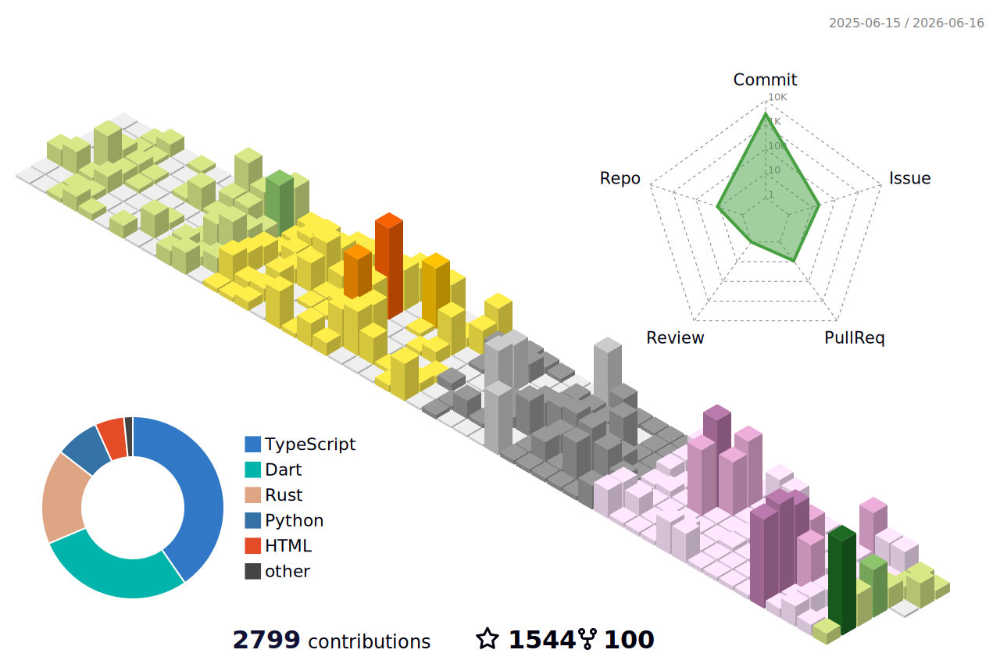

# ⚡ iota9star

**Full Stack Developer · Rust & Java Backend · Product Thinker** 🚀

## 👨‍💻 About Me

Hey, I'm **iota9star** — a developer who believes great software is equal parts engineering and empathy. I architect high-performance Rust backends by day and craft pixel-perfect Flutter experiences by night, treating every commit as a product decision. ✨

As a core maintainer in the **Flutter Candies** ecosystem, I build tools that thousands of developers depend on daily. Off the keyboard, I'm deep into Web3 protocols, AI-powered workflows, and anime culture. I write code that removes friction — for myself and for everyone else. 🎯

## 🎯 What I Do

- 🦀 **Backend Systems** — Rust (Axum) & Java (Spring) microservices designed for throughput and resilience
- 📱 **Cross-Platform Apps** — Flutter & Dart apps with native-quality polish on every platform
- 🌐 **Modern Frontend** — React & Vue SPAs with clean architecture and delightful UX
- 🤖 **AI-Enhanced Dev** — Agents, assistants, and automated workflows that ship better code faster
- ⛓️ **Web3 Exploration** — BTC, EVM, and Internet Computer ecosystems
- 🧩 **Open Source Craft** — Developer tooling that turns complex problems into simple APIs

## 🛠️ Tech Stack

**Languages**

**Backend & Infra**

**Frontend & Mobile**

## 📊 Quick Stats

## 🔥 Featured Projects

<table>
<tr>
<td align="center"></td>
<td align="center"></td>
</tr><tr>
<td align="center"></td>
<td align="center"></td>
</tr><tr>
<td align="center"></td>
<td align="center"></td>
</tr><tr>
<td align="center"></td>
<td align="center"></td>
</tr><tr>
<td align="center"></td>
<td align="center"></td>
</tr><tr>
<td align="center"></td>
<td align="center"></td>
</tr><tr>
<td align="center"></td>
<td align="center"></td>
</tr><tr>
<td align="center"></td>
<td align="center"></td>
</tr>
</table>

## 🏆 Highlights

- 🎖️ Core contributor to **Flutter Candies** — essential libraries powering the Flutter ecosystem
- 📦 Author of Dart/Flutter packages used across the community — from layout engines to tooling
- 🌉 Bridging Rust's zero-cost abstractions with Dart's developer ergonomics
- 🔍 Obsessed with developer experience — if it removes friction, it ships
- 🎯 16+ open source projects spanning backend, frontend, mobile, and devtools
- 🧠 Exploring the intersection of AI agents and software engineering workflows

## 💡 Quote

> 📖 自由意志问题也可以被区分为浅问题和深问题。
> — 自由意志的深问题及其知识论的解决方案

## 💭 Philosophy

I write software with a product-first lens — every abstraction exists to serve the user, not to impress the reviewer. I value simplicity over cleverness, shipping over perfecting, and empathy over ego. The best tools are invisible: they dissolve complexity so you can focus on what matters. 🧠

In a world of over-engineering, I reach for the simplest thing that works — and refactor when the real requirements show up. The code I'm proudest of is the code nobody notices because it just works. 🌊

## 🌱 Contribution Activity

## 📧 Connect With Me

Built with ☕ and curiosity · Profile generated with ❤️

