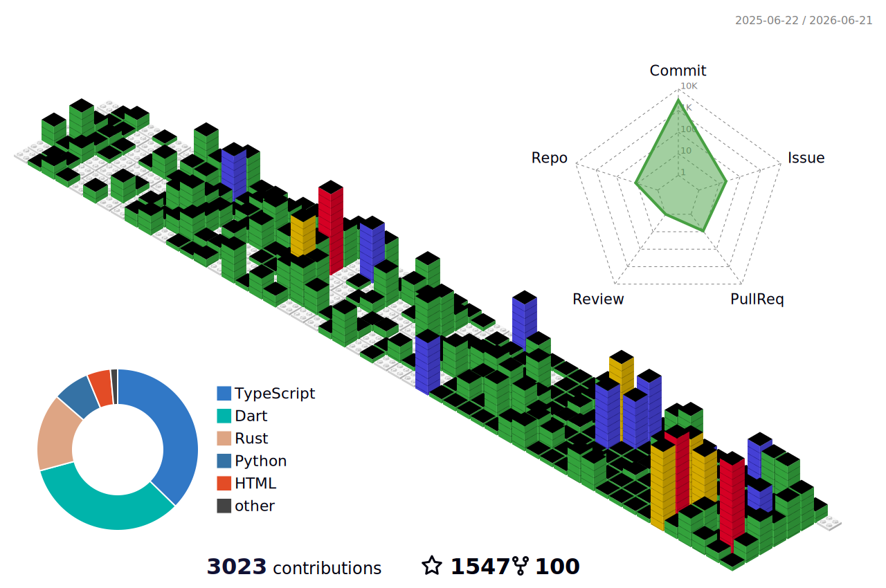

# Hi there! I'm iota9star 👋

A Full Stack Developer passionate about building digital experiences across the entire stack — from high-performance backends to elegant frontends. I write code that solves real problems.

## 👨‍💻 About Me

I'm a developer who loves turning ideas into reality through code. My journey spans multiple domains — from mobile development with Flutter to backend systems in Rust and Java. I believe in the power of open source and actively contribute to projects that make developers' lives easier.

When I'm not coding, you'll find me exploring new technologies, contributing to the Flutter community, or diving deep into blockchain and Web3 technologies. I'm particularly interested in BTC, EVM, and IC ecosystems.

## 🎯 What I Do

**Backend Development** — Building scalable, high-performance services using Rust's async ecosystem and Spring's enterprise-grade capabilities. Microservices architecture is my playground.

**Frontend & Mobile** — Crafting beautiful, responsive interfaces with React and Vue. Building cross-platform mobile apps with Flutter that feel native on every device.

**Developer Tools** — Creating utilities and libraries that streamline development workflows. From JSON generators to layout managers, I build tools I wish existed.

**Open Source Contributions** — Active contributor to fluttercandies, maintaining and improving packages that power thousands of Flutter apps worldwide.

## 🛠️ Tech Stack

## 📊 Quick Stats

## 🔥 Featured Projects

<table>
<tr>
<td align="center"></td>
<td align="center"></td>
</tr><tr>
<td align="center"></td>
<td align="center"></td>
</tr><tr>
<td align="center"></td>
<td align="center"></td>
</tr><tr>
<td align="center"></td>
<td align="center"></td>
</tr><tr>
<td align="center"></td>
<td align="center"></td>
</tr><tr>
<td align="center"></td>
<td align="center"></td>
</tr><tr>
<td align="center"></td>
<td align="center"></td>
</tr><tr>
<td align="center"></td>
<td align="center"></td>
</tr>
</table>

## 💡 Daily Inspiration

> 原是今生今世已惘然，山河岁月空惆怅，而我，终将是要等着你的。

## 🏆 Highlights

Contributing to open source projects used by thousands of developers worldwide. My work on Flutter utilities and layout systems has helped make app development more efficient and enjoyable.

Active member of the fluttercandies community, where we collaborate on innovative solutions for common Flutter development challenges.

## 📧 Connect With Me

## 💭 Philosophy

Code is more than syntax — it's a craft. I strive to write clean, maintainable, and efficient code that stands the test of time. Every line should have purpose, every function should be clear, and every project should make someone's life a little better.

Learning never stops in tech. I embrace new challenges and share knowledge with the community. Let's build something amazing together!

---

