# 👋 Hi, I'm **iota9star**

**Full Stack Developer | Rust & Java Backend | Product Mindset**

Building digital experiences across the stack — from high-performance backends to elegant frontends.  

## 👨‍💻 About Me  

I'm a passionate developer who loves crafting software that makes a difference. With expertise spanning multiple domains from systems programming to modern web development, I bring ideas to life through code. My journey involves continuous learning and contributing to open source projects that empower developers worldwide.

## 🎯 What I Do  

- 🚀 **Backend Development**: Building scalable microservices and high-performance systems with Rust and Java  
- 🎨 **Frontend Engineering**: Creating responsive and intuitive user interfaces with React, Vue, and Flutter  
- 🤖 **AI-Powered Development**: Leveraging AI assistants and workflows to enhance code quality and productivity  
- 🔗 **Web3 Technologies**: Exploring blockchain ecosystems including BTC, EVM, and Internet Computer  
- 📱 **Mobile Development**: Building native and cross-platform applications for Android and iOS  

## 🛠️ Tech Stack  

**Languages**: 🦀 Rust · ☕ Java · 🎯 Kotlin · 📘 TypeScript · 🎯 Dart  
**Backend**: ⚡ Axum · 🌱 Spring · 🔧 Microservices · 🟢 Node.js  
**Frontend**: ⚛️ React · 🟢 Vue · 🦋 Flutter · 🤖 Android  
**AI Tools**: 🤖 AI Agents · 🔍 Code Quality · 🧠 Development Workflows  
**Web3**: 🔗 Bitcoin · 💎 EVM · 🌐 Internet Computer  
**Tools**: 🔧 Git · 🐳 Docker · ☁️ Cloud Services  

## 📊 Quick Stats  

- 🏗️ **16+** Open Source Projects  
- 🌟 **Contributing** to Flutter Community  
- 💻 **Full-Stack** Development Expertise  
- 🎓 **Continuous Learner** & Knowledge Sharer  

## 🔥 Featured Projects  

[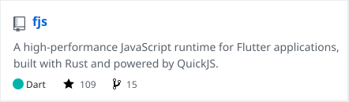](https://github.com/fluttercandies/fjs)
[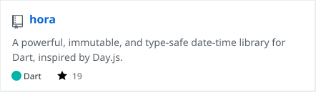](https://github.com/fluttercandies/hora)
[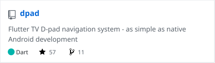](https://github.com/fluttercandies/dpad)

[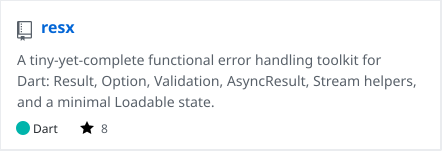](https://github.com/fluttercandies/resx)
[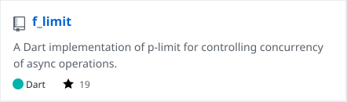](https://github.com/fluttercandies/f_limit)
[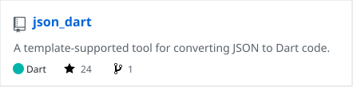](https://github.com/fluttercandies/json_dart)

[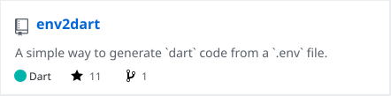](https://github.com/fluttercandies/env2dart)
[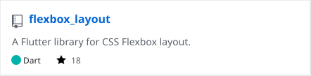](https://github.com/fluttercandies/flexbox_layout)
[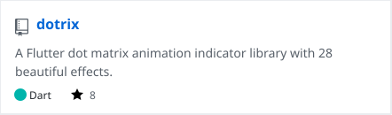](https://github.com/fluttercandies/dotrix)

[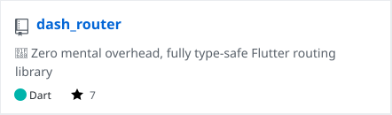](https://github.com/fluttercandies/dash_router)
[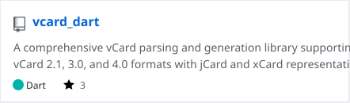](https://github.com/fluttercandies/vcard_dart)
[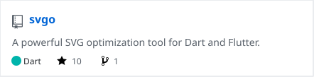](https://github.com/fluttercandies/svgo)

[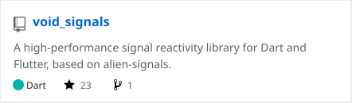](https://github.com/void-signals/void_signals)
[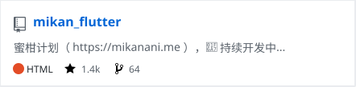](https://github.com/iota9star/mikan_flutter)
[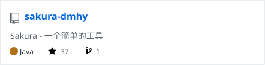](https://github.com/iota9star/sakura-dmhy)
[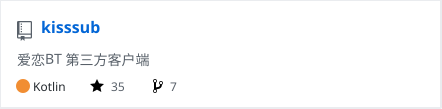](https://github.com/iota9star/kisssub)

## 💡 Quote  

> *"凝霜灿雪偃月刀，鲜衣怒马少年郎。"*  

## 🏆 Highlights  

- 🎯 **Flutter Community Contributor**: Active member of fluttercandies, creating tools that empower Flutter developers  
- 🔧 **Tool Builder**: Author of multiple development utilities and productivity tools  
- 🌟 **Open Source Advocate**: Strong believer in collaborative development and knowledge sharing  
- 💡 **Problem Solver**: Passionate about tackling complex challenges with elegant solutions  

## 🚀 My Approach  

I believe in writing clean, maintainable code that stands the test of time. Every project is an opportunity to learn something new and push boundaries. Whether it's optimizing performance, improving user experience, or exploring emerging technologies, I approach each challenge with curiosity and determination.  

Quality matters. I focus on creating solutions that not only work but work well—scalable, efficient, and user-friendly. The best code is code that others can understand, build upon, and enjoy working with.  

## 📧 Connect  

Let's connect and build something amazing together!  

- 📧 **Email**: [iota9star@gmail.com](mailto:iota9star@gmail.com)  
- ️⃣ **X (Twitter)**: [@iota9star](https://x.com/iota9star)  
- 📝 **Blog**: [掘金](https://juejin.cn/user/1591748568562829)  

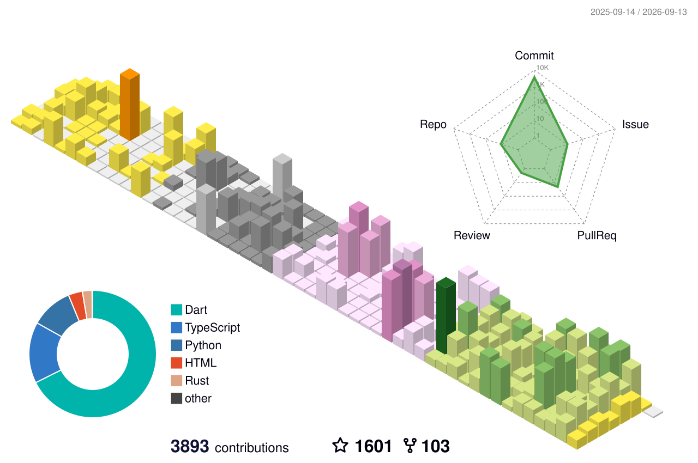

---

*Always learning, always building, always pushing forward* 🚀