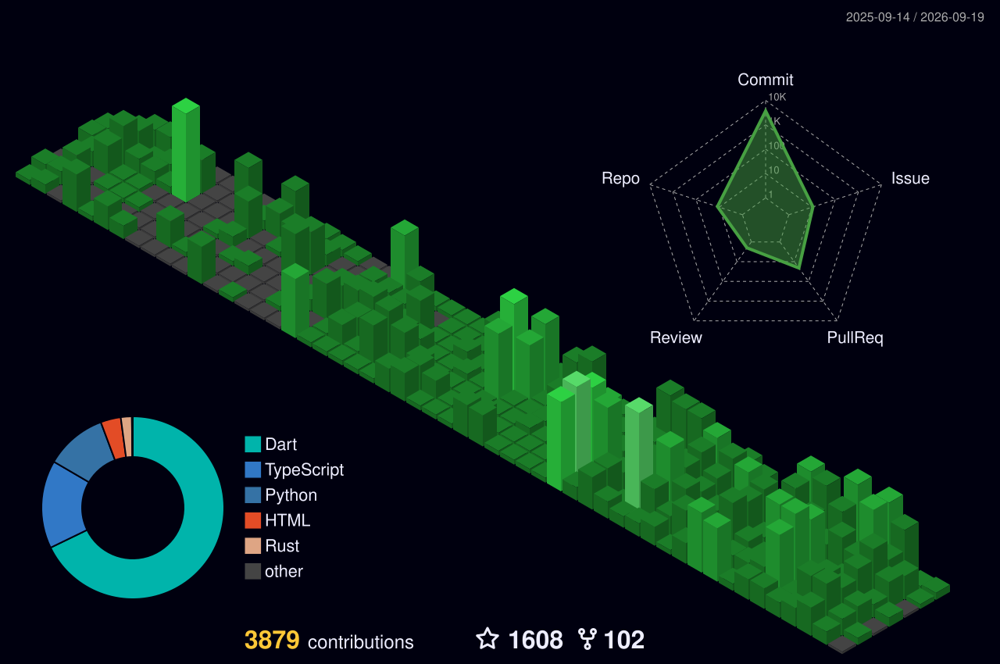

# 👋 Hi, I'm **iota9star**

**Full Stack Developer | Rust & Java Backend | Product Mindset**

Building digital experiences across the stack — from high-performance backends to elegant frontends. I turn complex problems into simple, beautiful solutions that users love.

## 👨‍💻 About Me

I'm a passionate developer who loves crafting clean code and delightful user experiences. With expertise spanning multiple languages and frameworks, I bring ideas to life through technology.

🎯 I believe in the power of open source and collaborative development. Every commit is an opportunity to learn, improve, and make a lasting impact on the developer community.

💭 My philosophy? Write code that humans can read, machines can execute, and future you will thank you for.

## 🎯 What I Do

### 🔧 Backend Development
Crafting scalable, high-performance server-side applications with Rust and Java. From microservices architecture to RESTful APIs, I build systems that handle millions of requests with elegance.

### 🎨 Frontend Engineering
Creating responsive, intuitive interfaces using React, Vue, and Flutter. I believe every pixel matters and every interaction should feel natural.

### 🤖 AI-Powered Workflows
Leveraging AI assistants and code agents to boost development productivity while maintaining code quality and architectural integrity.

### ⛓️ Web3 & Blockchain
Building the future of decentralized applications on BTC, EVM, and Internet Computer platforms.

## 🛠️ Tech Stack

### Languages
🦀 **Rust** | ☕ **Java** | 🟡 **Kotlin** | 🔷 **TypeScript** | 🎯 **Dart**

### Backend
⚡ **Axum** | 🌱 **Spring Boot** | 🔗 **Microservices** | 🚀 **Node.js**

### Frontend  
⚛️ **React** | 💚 **Vue.js** | 🦋 **Flutter** | 🤖 **Android**

### Areas of Focus
🧠 **AI/ML** | 🔗 **Web3** | ☁️ **Cloud** | 📱 **Mobile** | 🎨 **UI/UX**

## 📊 Quick Stats

## 🔥 Featured Projects

A curated collection of open-source projects I've contributed to or authored. Each one represents hours of passion, learning, and community collaboration.

## 💡 Quote

> "The best code is no code at all. Every line of code is a liability, not an asset."  
> — Jeff Atwood

## 🏆 Highlights

✨ **Open Source Contributor** - Active contributor to multiple Flutter ecosystem projects  
🚀 **Full Stack Expert** - End-to-end development from database to UI  
🎯 **Product Focused** - Technical solutions driven by user needs  
🌟 **Community Builder** - Helping others learn and grow through code

## 💭 Philosophy

Great software is built on three pillars:

🎨 **Simplicity** - Complexity is easy. Simplicity is hard. I strive to make the complex feel effortless.

⚡ **Performance** - Users shouldn't wait. Systems should scale. Every millisecond matters.

🤝 **Collaboration** - The best code emerges from diverse minds working together. Open source is my classroom and my contribution.

## 📧 Connect

Let's connect! I'm always excited to discuss technology, collaborate on projects, or just chat about development.

📧 **Email**: [iota9star@gmail.com](mailto:iota9star@gmail.com)  
🐦 **X**: [@iota9star](https://x.com/iota9star)  
📝 **Juejin**: [Blog](https://juejin.cn/user/1591748568562829)

---

---

*💻 Crafting code with passion • 🚀 Building the future one commit at a time • 🌟 Making open source better together*