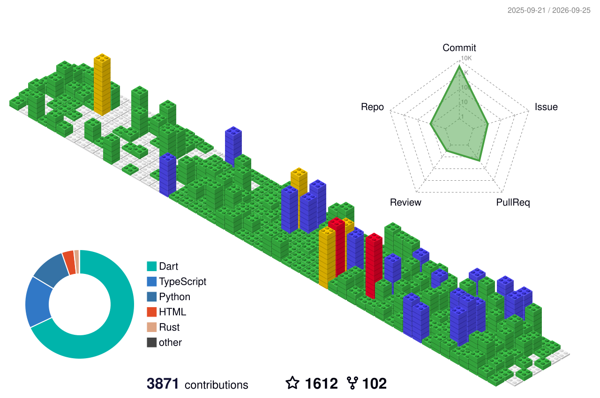

# 👋 Hi, I'm **iota9star**

**Full Stack Developer | Rust & Java Backend | Product Mindset**

Building digital experiences across the stack — from high-performance backends to elegant frontends.

---

## 🎯 What I Do

I craft solutions that span the entire development spectrum, combining technical excellence with product thinking to build software that matters.

- 🚀 **High-Performance Systems**: Building scalable backends with Rust and Java that handle millions of requests
- 🎨 **Beautiful Frontends**: Creating elegant user interfaces with modern frameworks and responsive design  
- 🤖 **AI-Powered Development**: Leveraging AI assistants and code agents to boost productivity and quality
- 🔗 **Full-Stack Architecture**: Designing cohesive systems from database to UI with microservices expertise
- ⛓️ **Web3 Innovation**: Working across BTC, EVM, and Internet Computer ecosystems

---

## 🛠️ Tech Stack

### 💻 Languages
    

### ⚙️ Backend
  

### 🎨 Frontend & Mobile
   

### 🔗 Web3 & Blockchain
  

### 🤖 AI & Tools
- AI-powered development workflows and code assistants
- Quality-focused testing and automated agents
- Microservices architecture patterns

---

## 📊 Quick Stats

📈 Open source contributor across multiple ecosystems  
🌟 Building tools that developers love to use  
💡 Focused on performance, scalability, and user experience  

---

## 🔥 Featured Projects

Check out some of my work across Flutter development, tools, and applications:

### Flutter Development Tools 🛠️

### Applications 📱

### Signal Processing 📡

---

## 💡 Philosophy

**"Code is poetry, architecture is art, and products are stories.**

**I believe in building software that not only works flawlessly but also brings joy to users and developers alike."**

Great software is the intersection of technical excellence, thoughtful design, and genuine understanding of user needs. I strive to create solutions that are performant, maintainable, and delightful to use.

---

## 🏆 Highlights

✨ **Open Source Contributor**: Actively contributing to the Flutter ecosystem and developer tools  
🎯 **Full-Stack Expertise**: Comfortable working across the entire technology stack  
🚀 **Performance-Focused**: Building systems that scale and perform under pressure  
🤝 **Community Builder**: Believer in collaborative development and knowledge sharing  
🔄 **Continuous Learner**: Always exploring new technologies and best practices  

---

## 📧 Connect

Let's connect and build something amazing together!

📧 **Email**: [iota9star](mailto:iota9star@gmail.com)  
🐦 **X**: [@iota9star](https://x.com/iota9star)  
📝 **Blog**: [Juejin](https://juejin.cn/user/1591748568562829)

---

*"The best code is the code that makes people's lives better."*

---

