# 🌿 iota9star · deep roots, tiny packages, tall stacks

   

Hi, I'm **iota9star** 👋 — a full-stack developer with a product mindset 🧭, happiest somewhere between a Rust borrow checker and a 60fps Flutter frame.  
I tend a small orchard of open-source packages 🌱: tiny, sharp, type-safe tools that other people's apps lean on without ever noticing.  
Deep roots in **Rust & Java** backends, blossoms in **Flutter & React** frontends — the stack changes, the obsession with the details doesn't ✨.

## 👨‍💻 About Me

I'm an engineer-gardener 🌿 by temperament: I plant many small things, water them with tests, and prune anything that grows ceremony instead of value. What fascinates me most is the last 5% everyone skips — the animation curve that feels inevitable, the error message that actually helps, the cold start that quietly disappears. Get the iotas right and the stars take care of themselves ⭐.

My natural habitats, one per altitude:

- 🦀 **Rust** — when performance *is* the feature and the compiler is my strictest, fairest reviewer
- ☕ **Java & Kotlin** — when systems must run for years, quietly, without drama
- 🎯 **Dart & Flutter** — when one codebase has to shine on phones, desktops and TVs alike
- 🌐 **TypeScript** — when the browser is the stage and React or Vue is the cast
- 🤖 **AI-assisted workflows** — agents and review loops that compound every sprint, never party tricks

🔬 **Currently exploring:** Rust-powered JavaScript runtimes, fine-grained signal reactivity, TV-first D-pad navigation, and all the ways a compiler can catch my bugs before my users do 🧠.

## 🎯 What I Do

- ⚙️ **Backend Engineering** — Axum & Spring microservices that stay boring under load, the highest compliment infrastructure can earn
- 📱 **Cross-Platform Apps** — Flutter & Android products that feel born on whichever screen they land on
- 🌐 **Frontend Craft** — React & Vue interfaces shaped by product thinking, not ticket queues
- 📦 **OSS Package Design** — small, sharp Dart/Flutter libraries with strict types and honest READMEs
- 🤖 **AI-Powered Development** — code assistants and quality-first agent workflows woven into real shipping
- ⛓️ **Web3 Primitives** — BTC, EVM & Internet Computer: past the hype, into the mechanics

## 🛠️ Tech Stack

**🗣️ Languages**     

**🔧 Backend**    

**🖥️ Frontend**    

**🤖 AI & Workflows**   

**⛓️ Web3**   

## 📊 Quick Stats

- 📦 **101** public repositories — the 16 charted below are the ones I'd carry out of a fire 🔥
- ⭐ **1,751** combined stars across featured projects, the flagship alone carrying 1.4k 🥇
- 🍬 **12** packages published under the FlutterCandies umbrella
- 🔱 **64** forks of the flagship and counting
- 👥 **282** followers watching the garden grow 🌱
- 🎂 Building in the open since August 2016 — a decade of commits and counting ⏳

## 🔥 Featured Projects

Sorted by stars ⭐ — every card is a gate into the garden, click through 👇

[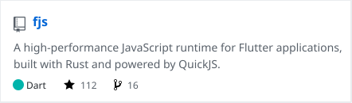](https://github.com/fluttercandies/fjs)
[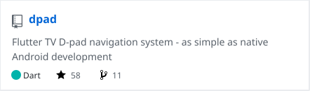](https://github.com/fluttercandies/dpad)

[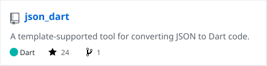](https://github.com/fluttercandies/json_dart)
[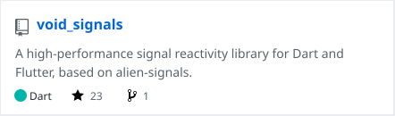](https://github.com/void-signals/void_signals)
[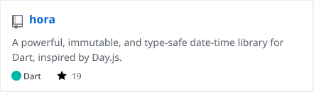](https://github.com/fluttercandies/hora)
[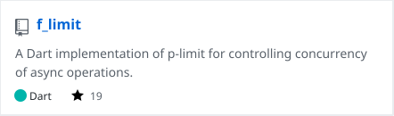](https://github.com/fluttercandies/f_limit)
[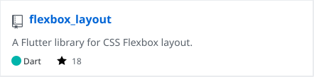](https://github.com/fluttercandies/flexbox_layout)
[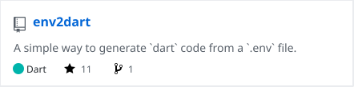](https://github.com/fluttercandies/env2dart)
[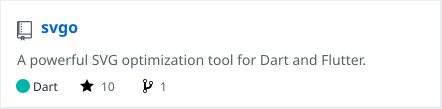](https://github.com/fluttercandies/svgo)
[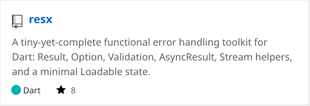](https://github.com/fluttercandies/resx)
[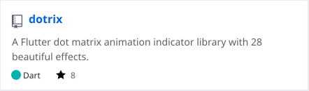](https://github.com/fluttercandies/dotrix)

[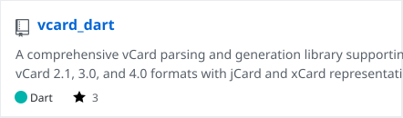](https://github.com/fluttercandies/vcard_dart)

## 🏆 Brightest Blossoms

- 🥇 **[mikan_flutter](https://github.com/iota9star/mikan_flutter)** ⭐ 1.4k — a polished third-party Flutter client for the Mikan Project (mikanani.me), still blooming under active development 🌸
- ⚡ **[fjs](https://github.com/fluttercandies/fjs)** ⭐ 109 — a high-performance JavaScript runtime inside Flutter: Rust & QuickJS under the hood 🦀
- 📺 **[dpad](https://github.com/fluttercandies/dpad)** ⭐ 58 — TV D-pad focus navigation for Flutter that feels as native as Android's
- 🌷 **[sakura-dmhy](https://github.com/iota9star/sakura-dmhy)** ⭐ 37 — a deliberately simple companion for the anime community, and 💞 **[kisssub](https://github.com/iota9star/kisssub)** ⭐ 35 — a Kotlin client for Ailian BT
- 🧩 **[json_dart](https://github.com/fluttercandies/json_dart)** ⭐ 24 — template-driven JSON → Dart code generation, zero ceremony
- 📡 **[void_signals](https://github.com/void-signals/void_signals)** ⭐ 23 — fine-grained signal reactivity for Dart & Flutter, grown from alien-signals
- ⏳ **[hora](https://github.com/fluttercandies/hora)** ⭐ 19 — immutable, type-safe date-time in the spirit of Day.js, and 🚦 **[f_limit](https://github.com/fluttercandies/f_limit)** ⭐ 19 — p-limit-style concurrency control for async Dart
- 🎛️ **[flexbox_layout](https://github.com/fluttercandies/flexbox_layout)** ⭐ 18 — CSS Flexbox layout, natively in Flutter
- 🪄 **[env2dart](https://github.com/fluttercandies/env2dart)** ⭐ 11 — turn any `.env` file into type-safe Dart code
- 🎨 **[svgo](https://github.com/fluttercandies/svgo)** ⭐ 10 — a powerful SVG optimization tool for Dart & Flutter
- 🧯 **[resx](https://github.com/fluttercandies/resx)** ⭐ 8 — tiny-yet-complete functional error handling: `Result`, `Option`, `Validation`, `AsyncResult` and stream helpers
- 🟦 **[dotrix](https://github.com/fluttercandies/dotrix)** ⭐ 8 — dot-matrix animation indicators with 28 beautiful effects
- 🚀 **[dash_router](https://github.com/fluttercandies/dash_router)** ⭐ 7 — fully type-safe Flutter routing with zero mental overhead
- 🗂️ **[vcard_dart](https://github.com/fluttercandies/vcard_dart)** ⭐ 3 — comprehensive vCard parsing & generation: 2.1, 3.0, 4.0, jCard & xCard

## 💡 Quote

> 🐟 *"泉涸，鱼相与处于陆，相呴以湿，相濡以沫，不如相忘于江湖。"*  
> — *When the spring runs dry and fish lie stranded on land, they keep each other alive with damp breath and beads of foam — but far better that they forget each other in the rivers and lakes.*  
> — 庄子 (Zhuangzi), *Inner Chapters · The Great Master* · via [hitokoto](https://hitokoto.cn)  
> 🤖 Heroic survival hacks are noble; the real fix is an environment where nobody needs them. Refactor the pond, not the fish 💧.

## 💭 Philosophy

- 🌱 Plant many small seeds, prune ruthlessly — libraries should be easy to delete, not easy to defend
- 🛡️ Types are documentation that can't rot: bugs the compiler catches are bugs users never meet
- ⚡ Write performance users can feel and code reviewers can actually read
- 🧭 The last 5% *is* the product — ship the polish, not just the feature
- 🔁 Ship, measure, refine — let the product argue, not the ego
- 💧 Fix the pond, not the fish — most hard problems are hard because the environment is wrong
- 🌍 Open source is how one developer says thank you to thousands

## 📧 Connect

- 📮 Email — [iota9star@gmail.com](mailto:iota9star@gmail.com)
- 🐦 X (Twitter) — [@iota9star](https://x.com/iota9star)
- ⛏️ Juejin — [Blog](https://juejin.cn/user/1591748568562829)

## 🌌 The Year, Rendered in 3D

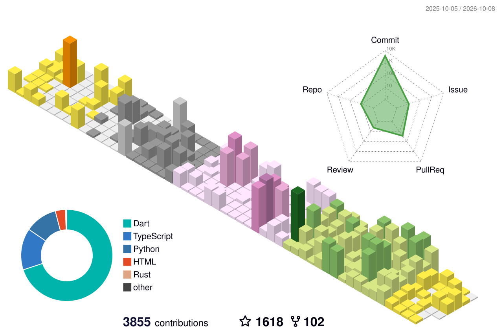

⭐️ From [iota9star](https://github.com/iota9star) — deep roots, tiny packages, tall stacks 🌿
