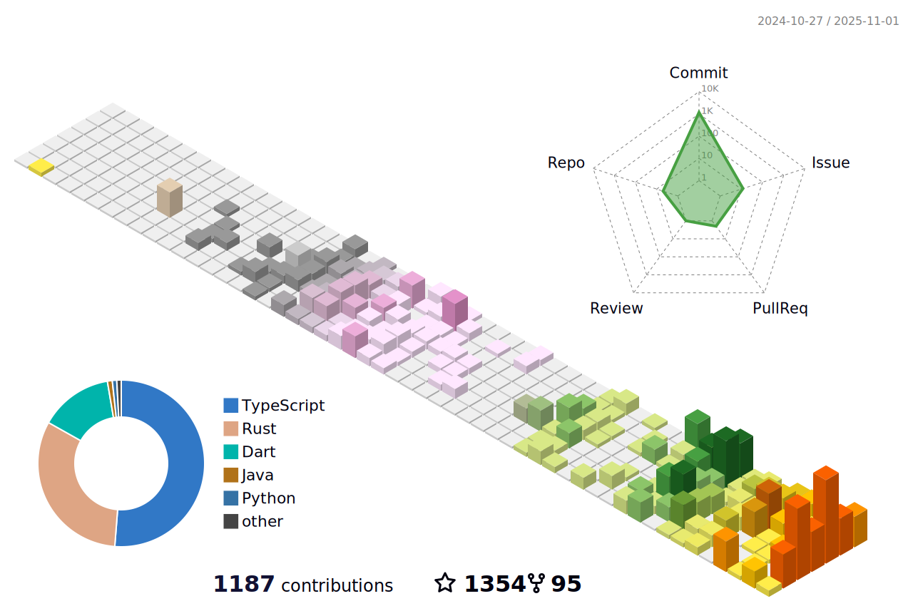

# Hi there! 👋

I'm **iota9star**, a Full Stack Developer passionate about building digital experiences across the entire stack — from high-performance backends to elegant frontends.

## 👨‍💻 About Me

I'm a developer who loves crafting quality software with a product mindset. I believe in writing clean, maintainable code that solves real problems. Whether it's optimizing Rust backend services, building responsive Flutter apps, or contributing to open source projects, I bring enthusiasm and attention to detail to everything I do.

## 🎯 What I Do

- **Backend Development**: Building scalable, high-performance services with Rust and Java
- **Frontend Engineering**: Creating beautiful, responsive user experiences with Flutter, React, and Vue
- **Mobile Development**: Crafting native-like cross-platform apps with Flutter and Android
- **Open Source**: Contributing to projects that make developers' lives easier
- **AI Integration**: Leveraging AI-powered workflows to enhance development productivity

## 🛠️ Tech Stack

### Languages
    

### Backend
  

### Frontend & Mobile
   

### Other
 

## 📊 Quick Stats

## 🔥 Featured Projects

<table>
<tr>
<td align="center"></td>
<td align="center"></td>
</tr><tr>
<td align="center"></td>
<td align="center"></td>
</tr><tr>
<td align="center"></td>
<td align="center"></td>
</tr><tr>
<td align="center"></td>
<td align="center"></td>
</tr><tr>
<td align="center"></td>
<td align="center"></td>
</tr><tr>
<td align="center"></td>
<td align="center"></td>
</tr><tr>
<td align="center"></td>
<td align="center"></td>
</tr><tr>
<td align="center"></td>
<td align="center"></td>
</tr>
</table>

## 💡 Quote

> 西方人并不比东方人聪明，但是他们却找对了路。 — 三体

## 🏆 Highlights

- 🚀 Contributing to multiple Flutter ecosystem projects at fluttercandies
- 📱 Building open-source mobile applications for anime and media content
- 🛠️ Creating developer tools and utilities that streamline workflows
- 🌐 Working with blockchain technologies (BTC, EVM, IC)

## 💭 Philosophy

I believe that great software is built by developers who understand both the technical and human aspects of product development. Writing code is not just about syntax and algorithms — it's about understanding user needs, collaborating effectively with teams, and continuously learning and improving.

## 📧 Connect

Let's connect and build something amazing together!

- 📧 Email: [iota9star@gmail.com](mailto:iota9star@gmail.com)
- 🐦 X: [@iota9star](https://x.com/iota9star)
- 📝 Blog: [Juejin](https://juejin.cn/user/1591748568562829)

⭐️ Thanks for visiting my profile! Feel free to explore my repositories and reach out if you'd like to collaborate.
